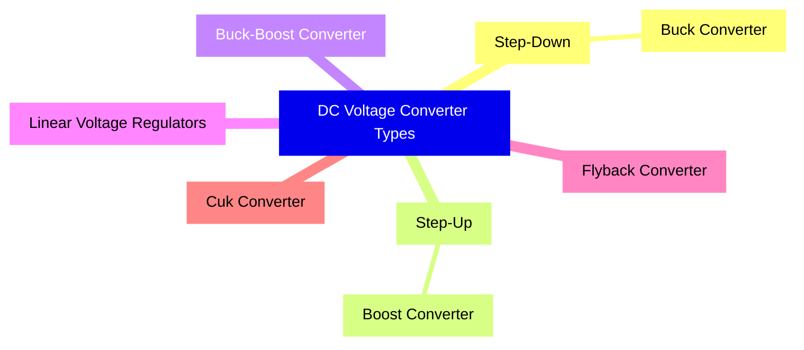

# Circuit Design Tasks

```

- List and shortly describe DC voltage converter types you know.

- Suggest a solution for connecting a discrete NPN inductive sensor to an MCU. Sensor is installed outside of the electronic unit.

- Suggest a solution for a bidirectional drive suitable for a 48V 500W DC motor. Solution must be complete, i.e. include critical components selection, as well as calculations or mechanical design nuances if required by solution.

- Suggest a solution for connecting a ratiometric bidirectionalanalog sensor to MCU (you can refer to SS94A1 as an example).

Note: ratiometric means that zero readings correspond to some voltage which depends
on the powering voltage (normally Vcc/2). Bidirectional means that output voltage can
change both ways (increase or decrease) depending on the “sign” of measured analog
value.

Note: in circuit design tasks no design with ECADs is required. Sketches in pencil or visio-like
diagrams are enough.

```

---
### Disclaimer: 
- Below is my best attempt at solving the given challenges
- I am always dedicated to learning more about electronics

---

## 1. DC voltage converter types:

### a. Buck Converter (Step-Down Converter):
Converts a higher DC input voltage to a lower DC output voltage using an inductor, a switch (usually a MOSFET), and a diode.

### b. Boost Converter (Step-Up Converter):
Converts a lower DC input voltage to a higher DC output voltage using similar components as the buck converter.

### c. Buck-Boost Converter:
A combination of buck and boost converters. It can either step up or step down the voltage based on the duty cycle of the switching transistor.

### d. Linear Voltage Regulators:
Provides a constant output voltage by dissipating excess power in the form of heat. They're not as efficient as switch-mode power supplies but are simpler and produce less noise.

### e. Flyback Converter:
Uses a transformer to isolate the input from the output and can produce multiple output voltages. Suitable for higher power levels.

### f. Cuk Converter:
A type of DC-DC converter that has both buck and boost operations with non-inverted output.




---

## 2. Connecting a discrete NPN inductive sensor to an MCU:

Maybe a simple pull-up resistor would do the job + protection diode & filter caps.
<details><summary><h3>pull-up resistor circuit sketch</h3><b>toggle me</b></summary>


</details>

1. Connect the sensor's power supply to an appropriate voltage (as specified by the sensor).

2. Connect the output of the sensor to an MCU input pin.

3. Use a pull-up resistor between the MCU pin and Vcc. 

This will ensure the input reads "high" when the sensor is not activated and "low" when it is activated.
(assuming it goes "low" or to ground when active)

4. Ensure to add protection mechanisms, such as a diode (to prevent back EMF) and a capacitor for noise filtering.


> a level shifter could be used if MCU digital pin operates at voltages other than supplied
(note this shows for PNP ind. prox sensor)
[source: electronics.stackexchange.com (link)](https://electronics.stackexchange.com/questions/101624/how-to-connect-a-inductive-proximity-sensor-switch-npn-dc6-36v-to-pic18f4550-5v)

<details><summary><h3>level shifter circuit sketch</h3><b>toggle me</b></summary>


</details>


> if the inductive sensor is not discrete then I think an optocoupler could also work
[source: forum.allaboutcircuits.com (link)](https://forum.allaboutcircuits.com/threads/inductance-proximity-sensor-output-conversion-to-3-3v-logic.160957/)

<details><summary><h3>optocoupler circuit sketch</h3><b>toggle me</b></summary>


</details>


---

## 3. Bidirectional drive for a 48V 500W DC motor:
For this power level, an <b>H-bridge</b> configuration is recommended using power MOSFETs.

H-bridge configuration - This uses 4 MOSFETs to control the direction of the motor.

MOSFET selection: 

Choose MOSFETs that can handle a voltage higher than 48V and a continuous current higher than the motor's rated current (500W/48V = 10.42A). 

Therefore, a good choice would be MOSFETs rated at 60V and 20A.

Gate driver: 

Use a dedicated gate driver IC to drive the MOSFETs. This ensures fast switching, reducing heat.

Protection: 

Include flyback diodes across each MOSFET to protect against back EMF from the motor.

PWM Control: 

To control the speed of the motor, a PWM signal can be applied to the gate driver. The MCU can generate this PWM signal.

Mechanical design: 

Ensure the H-bridge circuit has proper heatsinking as high current applications generate a lot of heat.

---

## 4. Connecting a ratiometric bidirectional analog sensor to MCU:

Using SS94A1 as an example, which is a linear Hall-effect sensor...

Powering: 

Power the SS94A1 with the MCU's Vcc. 
This ensures the ratiometric behavior is based on the MCU's Vcc.

Output Reading: 

Connect the output of SS94A1 to an ADC pin on the MCU.

Voltage Bias: 

Since it's ratiometric, at zero readings the output will be around Vcc/2. The MCU's ADC will interpret this as the midpoint.

Signal Conditioning: 

To improve measurement accuracy, consider adding an op-amp based voltage follower or buffer. This ensures minimal current is drawn from the sensor, preventing it from skewing the readings.

Protection: 

Add a capacitor close to the power pins of the sensor to filter out noise.

Interpretation: 

In software, readings above Vcc/2 imply one direction, while readings below Vcc/2 imply the opposite direction.